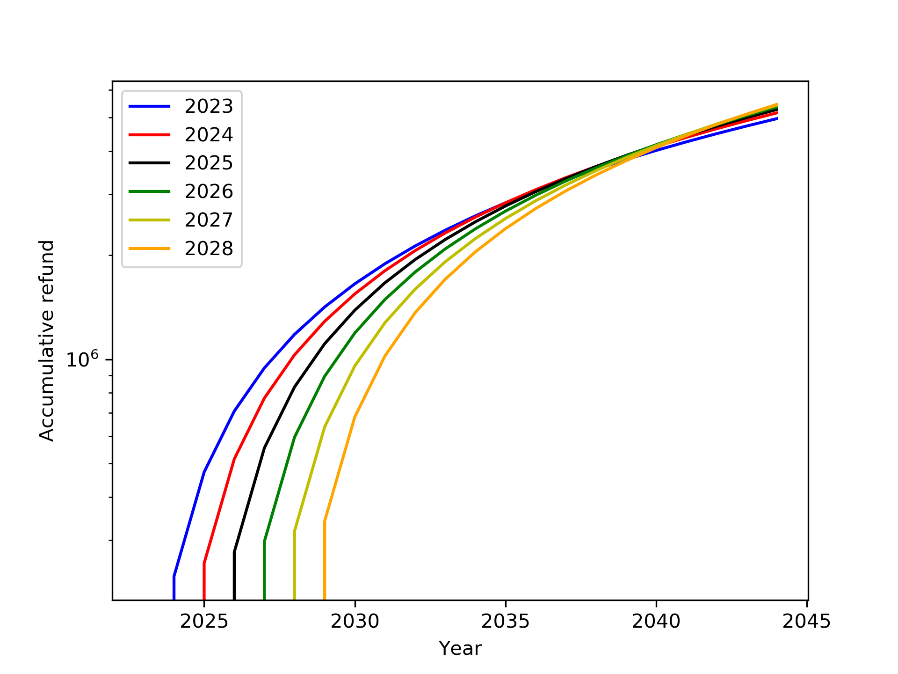

# LaborInsurance

This is a project to calculate the relation between accumulative refund and the year to start the refund. 

In Taiwan, the refund of the labor insurance depends on:
1. Total working experience (in years)
2. Yearly income
3. if start the refund earlier than the default age (65 years old).

To run the script, use command: 
```
python refund.py
```

# Output example 

